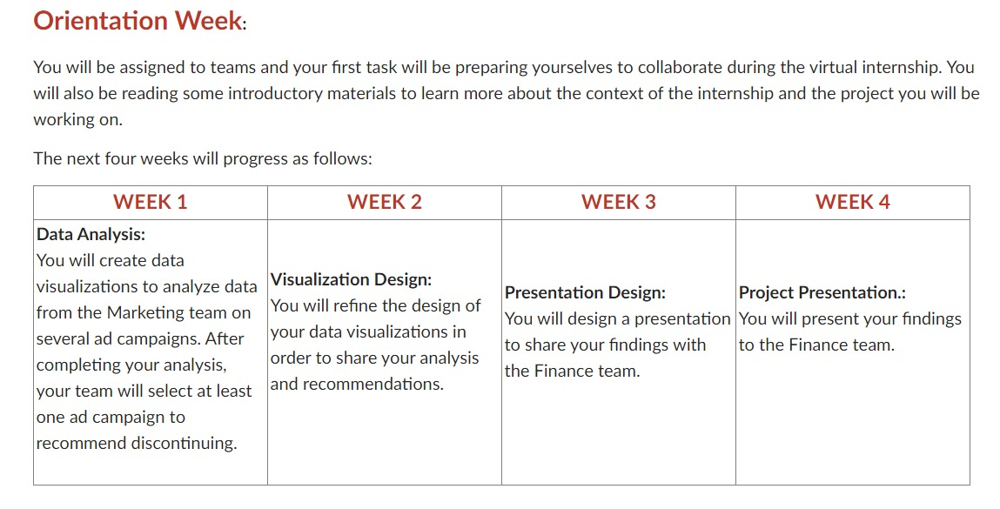

# 
NEU-GlobalShala-Internship

# Schedule

# Data Defination
Number of Campaigns Analyzed: 11
Each Campaign was analyzed on the basis of the following parameters:
1. Campaign ID and Name
2. Target audience for the ad. Can be either “students “ or “educators”  Age
3. Geography the ad was served in
4. Reach-no. of people who saw the ad atleast once
5. Impressions- no. of times the ad was on a screen
6. Frequency- average number of times a person saw an ad
7. Clicks
8. Total number of unique clicks
9. Click Through Rate –number of people who saw the add and clicked the link
10. Amount spent in INR
11. Cost spent per Click (CPC)
12. Cost per Result(CPR)-total amount spent/total result or unique link clicks

# CONCLUSION
1. After analyzing the dataset given to us, we can comprehend that there are several factors which we can be considered to decide whether to continue a particular campaign or not.
2. After a brief discussion we have decided that the most important factors to be considered for discontinuing a campaign are Reach, Clicks, Impressions, Amount spent in INR, and Unique Clicks.
3. After visualizing and comparing the results, we came to a conclusion that Campaign 3 is having the lowest number of reaches and impressions, while also having a higher amount spent. Therefore, Campaign 3 can be considered for removal due to their low result and cost efficiency.
 
